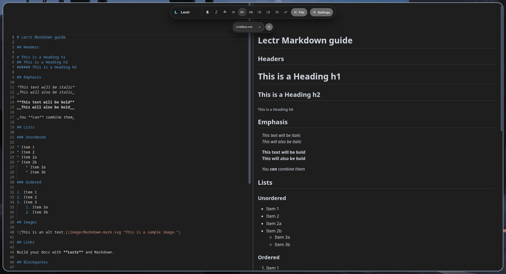
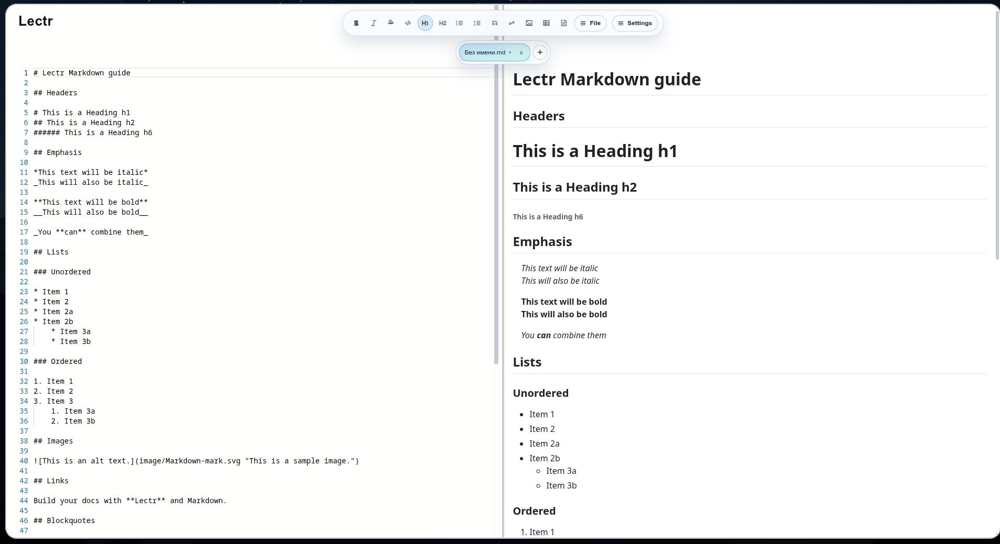
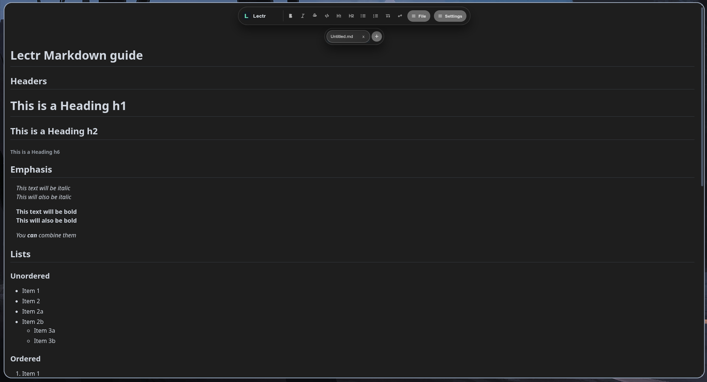

# 


RU | [EN](#lectr-en)

## Lectr RU

Lectr — Markdown-редактор с live preview и desktop-режимом на Electron.

  | Темная тема | Светлая тема | Редактирование на рендере |
  |---|---|---|
  |  |  |  |

### Возможности

- Редактор + рендер Markdown в реальном времени
- Вкладки файлов
- Открытие/сохранение/Save As
- Экспорт в PDF
- Переключение темы, локализация (RU/EN), масштаб интерфейса

### Требования

- Node.js 20+
- npm 10+

### Быстрый старт

Скачать приложение во вкладке релизов.

Или собрать самостоятельно:

```bash
npm install
npm run app:dev
```

### Команды

```bash
# Web-разработка (Vite)
npm run dev

# Сборка web-части
npm run build

# Просмотр собранной web-части
npm run serve-dist

# Desktop-режим (dev)
npm run app:dev

# Desktop-режим (локальный запуск из сборки)
npm run app

# Сборка релизных пакетов (Electron Builder)
npm run app:dist
```

### Лицензия

MIT. Подробнее в `LICENSE`.

---

## Lectr EN

Lectr is a Markdown editor with live preview and Electron desktop packaging.

  | Dark theme | Light theme | Edit in preview mode |
  |---|---|---|
  |  |  |  |

### Features

- Markdown editor + live rendered preview
- File tabs
- Open/Save/Save As
- PDF export
- Theme switch, localization (RU/EN), UI scaling

### Requirements

- Node.js 20+
- npm 10+

### Quick start

Download app for from releases page.

Or build manualliy:

```bash
npm install
npm run app:dev
```

### Commands

```bash
# Web development (Vite)
npm run dev

# Build web assets
npm run build

# Preview built web assets
npm run serve-dist

# Desktop dev mode
npm run app:dev

# Desktop local run from build
npm run app

# Build release packages (Electron Builder)
npm run app:dist
```

### License

MIT. More in `LICENSE`.
